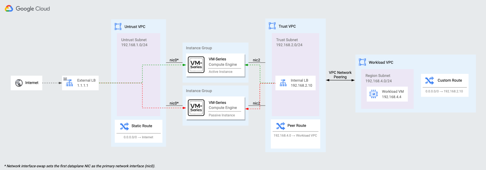
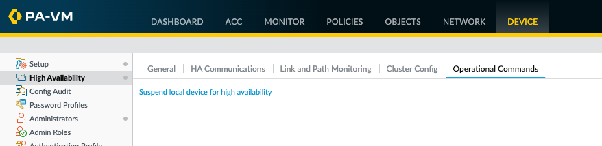
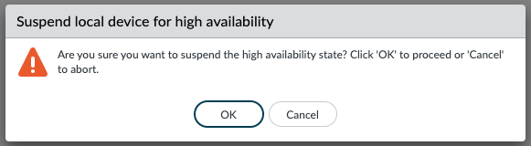

# Active/Passive High-Availability Deployment

## Overview

This deployment provides a traditional Active/Passive High Availability pair of VM-Series firewalls hosted in Google Cloud, and provides thew following benefits:
* Palo Alto Networks Configuration Sync
* State Synchronization between instances to maintain state on fail-over.
* Controlled High-Availability fail-over in approx. 3 seconds

This deployment model provides solutions for the following key use-cases:

* IPSec termination of site to site VPNs.
* Legacy applications that need visibility of the original source client IP (No SNAT solution) for inbound traffic flows.
* Requirements for session fail-over on failure of VM-Series.

Generally we would recommend a scale-out architecture, review [this link](https://cloud.google.com/architecture/partners/palo-alto-networks-ngfw) for guidance on which architecture is best for you.

## Diagram of Deployment



## Deploying the example Deployment

First you will need to clone the Github repository locally, to do this run the following command:

```shell
git clone https://github.com/paloaltonetworks/terraform-google-vmseries-modules
```

Now goto this example folder by running the following command:

```shell
cd terraform-google-vmseries-modules/examples/active_passive_ha
```

First we will need to set some variables for the deployment, make a copy of the provided example by running this command:

```shell
cp terraform.tfvars.example terraform.tfvars
```

Now edit the new `terraform.tfvars` file, an easy way to do this is using `nano` like this:
```shell
nano terraform.tfvars
```

Example 
```
region          = "europe-west2"
prefix          = "example-ha"
allowed_sources = ["0.0.0.0/0"]
cidr_mgmt       = "192.168.0.0/24"
cidr_untrust    = "192.168.1.0/24"
cidr_trust      = "192.168.2.0/24"
cidr_ha2        = "192.168.3.0/24"
cidr_workload   = "192.168.4.0/24"
public_key_path = "~/.ssh/gcp-demo.pub"
```


Now we're ready to start the deployment. First we need to initialize Terraform.

```shell
terraform init
```

Now you are ready to deploy the rest of the infrastructure:

```shell
terraform apply
```


When prompted review the plan and enter `yes` to proceed.

```
Plan: 68 to add, 0 to change, 0 to destroy.

Changes to Outputs:
  + vmseries01_access = (known after apply)
  + vmseries02_access = (known after apply)

Do you want to perform these actions?
  Terraform will perform the actions described above.
  Only 'yes' will be accepted to approve.

  Enter a value: 
```

When the build completes the following output will be generated.

```
Apply complete! Resources: 68 added, 0 changed, 0 destroyed.

Outputs:

external_nat_ip = "x.x.x.x"
vmseries01_access = "https://y.y.y.y"
vmseries02_access = "https://z.z.z.z"
```

All the infrastructure should now be deployed and will be booting up and configuring itself. To confirm when everything is ready you can open a web browser and visit the `external_nat_ip` by using `http://x.x.x.x` after a few mins you will see the apache default webpage from the `workload-vm`.

## Test the deployment

Next we will test the deployment to ensure everything is working correctly.

First lets look from the `workload-vm` to make sure its getting the correct IP and has internet connectvity throught the firewall.

To connect to the `workload-vm` run the following command:
```shell
gcloud compute ssh workload-vm
```

Next lets run some tests while we perform a failover, a script has been provided to help with this. Just run this command:

```shell
/network-check.sh
```

You will see output like this where `x.x.x.x` is the IP address is `external_nap_ip` address.
```
Wed Oct 12 16:40:18 UTC 2022 -- Online -- Source IP = x.x.x.x
Wed Oct 12 16:40:19 UTC 2022 -- Online -- Source IP = x.x.x.x
Wed Oct 12 16:40:20 UTC 2022 -- Online -- Source IP = x.x.x.x
Wed Oct 12 16:40:21 UTC 2022 -- Online -- Source IP = x.x.x.x
```

Now login to the VM-Series using the URLs provided at the end of the terraform deployment.

Open a browser and visit the two Management interfaces of the firewalls in different windows.

To login to the firewalls use the following details:

Username: `admin`
Password: `Pal0Alt0@123`

When you login you will notice the HA Status in the bottom right hand corner:


On the `Active` firewall goto the `Device` tab, and selexct `High Availabilty` from the left menu and the `Operational Commands` tab in the main window:



Select `Suspend local device for high availability` and when prompted ensure you're monitoring the output on the console of the `workload-vm` and select `OK`:



You may see `Offline` being registered for a couple of seconds or maybe the output will pause for a few seconds and continue. You will notice after the failover the Source IP is maintained, and if you were running a stateful session like SSH you would also notice that this session was maintained.

```
Wed Oct 12 16:47:18 UTC 2022 -- Online -- Source IP = x.x.x.x
Wed Oct 12 16:47:19 UTC 2022 -- Online -- Source IP = x.x.x.x
Wed Oct 12 16:47:21 UTC 2022 -- Offline
Wed Oct 12 16:47:22 UTC 2022 -- Offline
Wed Oct 12 16:47:23 UTC 2022 -- Online -- Source IP = x.x.x.x
Wed Oct 12 16:47:24 UTC 2022 -- Online -- Source IP = x.x.x.x
```

