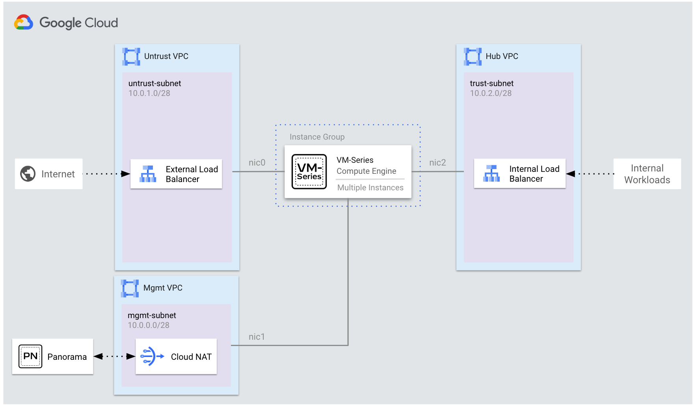

# Autoscale VM-Series Firewalls with MIGs


## Overview
This example deploys VM-Series firewalls through a Managed Instance Group (MIG).  The Instance Group enables the VM-Series to horizontally scale (i.e autoscaling) based on custom PAN-OS metrics delivered to Google Cloud Monitoring.  

Created resources include:
*  1 x Managed Instance Group.
*  1 x Service Account
*  1 x Pub/Sub Topic and Subscription
*  1 x Internal TCP/UDP load balancer to distribute egress traffic to VM-Series trust/hub interfaces.
*  1 x External TCP/UDP load balancer to distribute internet inbound traffic to VM-Series untrust/public interfaces.
*  3 x VPC Networks (`mgmt`, `untrust/public`, and `trust/hub` VPC networks).

> If you would like to deploy the VM-Series MIG into existing VPC networks, please see [`examples/autoscale_existing_vpcs`](../autoscale_existing_vpcs).

<p align="center">
    
</p>

## Requirements

1.  A Panorama appliance with network connectivity (`TCP/443` & `TCP/3978`) to the VM-Series MGMT interfaces.  This example assumes Panorama connects over the internet to the VM-Series MIG.  

>  If you do not have a Panorama appliance, please see `examples/panorama` to deploy Panorama on Google Cloud. 

2.  A Panorama `Device Group`, `Template Stack`, and [`VM Authorization Key`](https://docs.paloaltonetworks.com/vm-series/10-1/vm-series-deployment/bootstrap-the-vm-series-firewall/generate-the-vm-auth-key-on-panorama).  These values are required to bootstrap the VM-Series firewalls to Panorama.
3.  (For BYOL VM-Series licensing only) An authcode assigned to Device Group through [Panorama Software Firewall License Plugin](https://docs.paloaltonetworks.com/vm-series/10-1/vm-series-deployment/license-the-vm-series-firewall/use-panorama-based-software-firewall-license-management).


> For information on staging Panorama for VM-Series MIGs, see:
> * [Panorama Staging for VM-Series MIGs](../panorama/docs/panorama-staging-vmseries-migs.md)
> * [Autoscaling Components for Google Cloud](https://docs.paloaltonetworks.com/vm-series/9-1/vm-series-deployment/set-up-the-vm-series-firewall-on-google-cloud-platform/autoscaling-on-google-cloud-platform/autoscaling-components-for-gcp#id17COG5060BX)

## Deploy

1. Access a machine with Terraform installed (versions `>= 0.15.3` & `< 2.0`) or click **Open in Google Cloud Shell**.

<p align="center" width="100%">
  <a href="https://ssh.cloud.google.com/cloudshell/editor"> 
  </a>
</p>

2. Enable the required APIs, clone the Github repository, and change directories to the example build.

```
gcloud services enable compute.googleapis.com
git clone https://github.com/PaloAltoNetworks/terraform-google-vmseries-modules
cd terraform-google-vmseries-modules/examples/autoscale
```

3.  Create a file named `terraform.tfvars` in a text editor of your choice (i.e. Cloud Shell Editor, `vim`, or `nano`).

4. Paste the variables below into your `terraform.tfvars`.  Modify the values to match your environment.  A description of each variable can be found in [variables.tf](variables.tf).
```
project_id              = "my-project-id"
prefix                  = "panw"
region                  = "us-central1"
allowed_sources         = ["0.0.0.0/0"]
vmseries_image_name     = "https://www.googleapis.com/compute/v1/projects/paloaltonetworksgcp-public/global/images/vmseries-flex-bundle2-1014"
vmseries_instances_min  = 2
vmseries_instances_max  = 5
panorama_address        = "1.1.1.1"
panorama_device_group   = "my-panorama-device-group"
panorama_template_stack = "my-panorama-template-stack"
panorama_vm_auth_key    = "01234567890123456789"
```

5.  (Optional)  If you would like to deploy zone-based MIGs instead of regional MIGs, make the following changes in [`main.tf`](main.tf).
    1.  Within `module "autoscale"`, add the `zones` parameter and set `use_regional_mig=false`.
    2.  Within `module "intlb"`, configure backends parameter to use each output for `zonal_instance_group_id`. 

<pre>
module "autoscale" {
  source = "PaloAltoNetworks/vmseries-modules/google//modules/autoscale"

  name             = "${local.prefix}vmseries"
  region           = "us-central1"
  <b>use_regional_mig = false</b>
  <b>zones = {
    zone1 = "us-central1-a"
    zone2 = "us-central1-b"
  }</b>
  ...
  ...
}
...
...
module "intlb" {
  source = "PaloAltoNetworks/vmseries-modules/google//modules/lb_internal"

  name              = "${local.prefix}internal-lb"
  network           = data.google_compute_subnetwork.trust.network
  subnetwork        = data.google_compute_subnetwork.trust.self_link
  all_ports         = true
  health_check_port = 80
  backends = {
    <b>backend1 = module.autoscale.zone_instance_group_id["zone1"]
    backend2 = module.autoscale.zone_instance_group_id["zone2"]</b>
  }
  allow_global_access = true
}
</pre>

6.  Save your `terraform.tfvars` and deploy.

```
terraform init
terraform apply
```
> **Note:** The health probes on the external load balancer be down.  This is because a service must be configured behind the firewall to respond to the load balancer's health probes. 

<!-- BEGINNING OF PRE-COMMIT-TERRAFORM DOCS HOOK -->
## Requirements

| Name | Version |
|------|---------|
| <a name="requirement_terraform"></a> [terraform](#requirement\_terraform) | >= 0.15.3, < 2.0 |
| <a name="requirement_google"></a> [google](#requirement\_google) | ~> 3.48 |

## Providers

No providers.

## Modules

| Name | Source | Version |
|------|--------|---------|
| <a name="module_autoscale"></a> [autoscale](#module\_autoscale) | ../../modules/autoscale | n/a |
| <a name="module_extlb"></a> [extlb](#module\_extlb) | PaloAltoNetworks/vmseries-modules/google//modules/lb_external | n/a |
| <a name="module_iam_service_account"></a> [iam\_service\_account](#module\_iam\_service\_account) | PaloAltoNetworks/vmseries-modules/google//modules/iam_service_account | n/a |
| <a name="module_intlb"></a> [intlb](#module\_intlb) | PaloAltoNetworks/vmseries-modules/google//modules/lb_internal | n/a |
| <a name="module_mgmt_cloud_nat"></a> [mgmt\_cloud\_nat](#module\_mgmt\_cloud\_nat) | terraform-google-modules/cloud-nat/google | =1.2 |
| <a name="module_vpc_mgmt"></a> [vpc\_mgmt](#module\_vpc\_mgmt) | terraform-google-modules/network/google | ~> 4.0 |
| <a name="module_vpc_trust"></a> [vpc\_trust](#module\_vpc\_trust) | terraform-google-modules/network/google | ~> 4.0 |
| <a name="module_vpc_untrust"></a> [vpc\_untrust](#module\_vpc\_untrust) | terraform-google-modules/network/google | ~> 4.0 |

## Resources

No resources.

## Inputs

| Name | Description | Type | Default | Required |
|------|-------------|------|---------|:--------:|
| <a name="input_allowed_sources"></a> [allowed\_sources](#input\_allowed\_sources) | A list of IP addresses to be added to the management network's ingress firewall rule. The IP addresses will be able to access to the VM-Series management interface. | `list(string)` | n/a | yes |
| <a name="input_autoscaler_metrics"></a> [autoscaler\_metrics](#input\_autoscaler\_metrics) | The map with the keys being metrics identifiers (e.g. custom.googleapis.com/VMSeries/panSessionUtilization).<br>Each of the contained objects has attribute `target` which is a numerical threshold for a scale-out or a scale-in.<br>Each zonal group grows until it satisfies all the targets.<br><br>Additional optional attribute `type` defines the metric as either `GAUGE` (the default), `DELTA_PER_SECOND`, or `DELTA_PER_MINUTE`.<br>For full specification, see the `metric` inside the [provider doc](https://registry.terraform.io/providers/hashicorp/google/latest/docs/resources/compute_autoscaler). | `map` | <pre>{<br>  "custom.googleapis.com/VMSeries/panSessionActive": {<br>    "target": 100<br>  }<br>}</pre> | no |
| <a name="input_cidr_mgmt"></a> [cidr\_mgmt](#input\_cidr\_mgmt) | The CIDR range of the management subnetwork. | `string` | `"10.0.0.0/28"` | no |
| <a name="input_cidr_trust"></a> [cidr\_trust](#input\_cidr\_trust) | The CIDR range of the trust subnetwork. | `string` | `"10.0.2.0/28"` | no |
| <a name="input_cidr_untrust"></a> [cidr\_untrust](#input\_cidr\_untrust) | The CIDR range of the untrust subnetwork. | `string` | `"10.0.1.0/28"` | no |
| <a name="input_panorama_address"></a> [panorama\_address](#input\_panorama\_address) | The Panorama IP/Domain address.  The Panorama address must be reachable from the management VPC. This build assumes Panorama is reachable via the internet. The management VPC network uses a NAT gateway to communicate to Panorama's external IP addresses. | `string` | n/a | yes |
| <a name="input_panorama_device_group"></a> [panorama\_device\_group](#input\_panorama\_device\_group) | The name of the Panorama device group that will bootstrap the VM-Series firewalls. | `string` | n/a | yes |
| <a name="input_panorama_template_stack"></a> [panorama\_template\_stack](#input\_panorama\_template\_stack) | The name of the Panorama template stack that will bootstrap the VM-Series firewalls. | `string` | n/a | yes |
| <a name="input_panorama_vm_auth_key"></a> [panorama\_vm\_auth\_key](#input\_panorama\_vm\_auth\_key) | Panorama VM authorization key.  To generate, follow this guide https://docs.paloaltonetworks.com/vm-series/10-1/vm-series-deployment/bootstrap-the-vm-series-firewall/generate-the-vm-auth-key-on-panorama.html | `string` | n/a | yes |
| <a name="input_prefix"></a> [prefix](#input\_prefix) | Prefix to prepend the resource names (i.e. panw, or your initials).  This is useful for identifing the created resources. | `string` | n/a | yes |
| <a name="input_project_id"></a> [project\_id](#input\_project\_id) | GCP Project ID to contain the created cloud resources. | `string` | n/a | yes |
| <a name="input_region"></a> [region](#input\_region) | GCP region | `string` | n/a | yes |
| <a name="input_vmseries_image_name"></a> [vmseries\_image\_name](#input\_vmseries\_image\_name) | Link to VM-Series PAN-OS image. Can be either a full self\_link, or one of the shortened forms per the [provider doc](https://registry.terraform.io/providers/hashicorp/google/latest/docs/resources/compute_instance#image). | `string` | n/a | yes |
| <a name="input_vmseries_instances_max"></a> [vmseries\_instances\_max](#input\_vmseries\_instances\_max) | The maximum number of VM-Series that the autoscaler can scale up to. This is required when creating or updating an autoscaler. The maximum number of VM-Series should not be lower than minimal number of VM-Series. | `number` | `5` | no |
| <a name="input_vmseries_instances_min"></a> [vmseries\_instances\_min](#input\_vmseries\_instances\_min) | The minimum number of VM-Series that the autoscaler can scale down to. This cannot be less than 0. | `number` | `2` | no |
| <a name="input_vmseries_machine_type"></a> [vmseries\_machine\_type](#input\_vmseries\_machine\_type) | (Optional) The instance type for the VM-Series firewalls. | `string` | `"n2-standard-4"` | no |

## Outputs

No outputs.
<!-- END OF PRE-COMMIT-TERRAFORM DOCS HOOK -->