# VM-Series Blueprint: Hub-and-Spoke with VPC Peering

## Overview

Palo Alto Networks VM-Series ML-NGFW is the industry-leading virtualized security platform to protect applications and data with next-generation security features in Google Cloud.  In this blueprint, you will use a common set of VM-Series firewalls to secure internet inbound, internet outbound, and east-west traffic for a Google Cloud hub and spoke architecture.  This build focuses on how various traffic flows traverse through the VM-Series firewall (or hub).  You will also learn how to leverage Google Cloud network load balancers to provide horizontal scale and redundancy to your VM-Series deployments. 


## Objectives 

* Review the VM-Series hub-and-spoke architecture using VPC network peering. 
* Build the environment using Terraform by Hashicorp.
* Validate and visualize internet inbound, internet outbound, and east-west (VPC to VPC) traffic flows through Google Cloud load balancers and the VM-Series firewalls.


## Topology

The diagram below shoes the topology of the blueprint.  Everything depicted in the diagram is built with Terraform, including the local configuration of the compute resources.  All traffic to/from the spoke VPC networks traverses through the VM-Series firewalls for inpsection.  

<p align="center">
    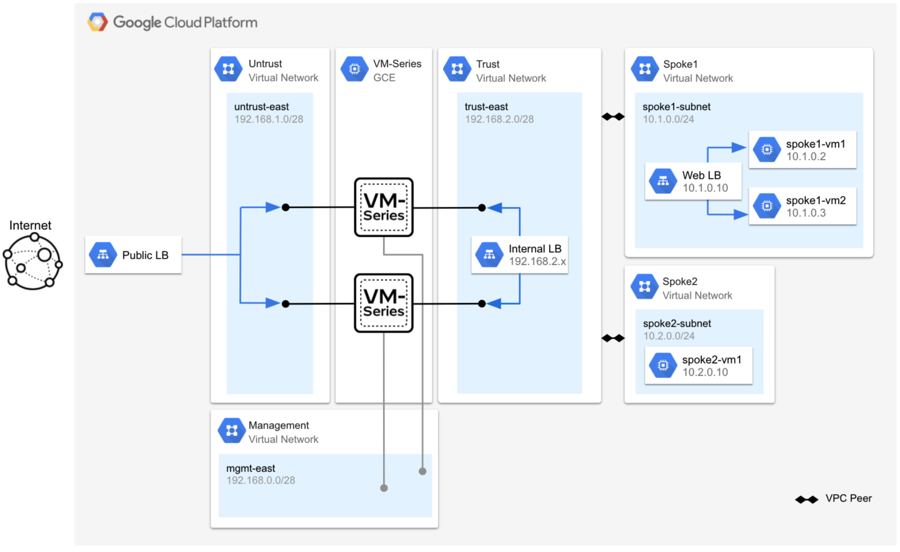
</p>

The table below provides a brief explanation of each VPC network with its intended function.  In short, the untrust, trust, and management VPC networks are used only by the VM-Series to secure traffic to/from the spoke VPC networks.  All private Google Cloud workloads should be deployed in the spoke VPC networks. 

_Table 1. VPC Network Description_
<table>
  <tr>
   <td><strong>VPC Network</strong>
   </td>
   <td><strong>Purpose</strong>
   </td>
  </tr>
  <tr>
   <td>Management
   </td>
   <td>The management VPC is used only to host the VM-Series management interfaces.  The management interfaces are used to access the VM-Series user interface or terminal console.
   </td>
  </tr>
  <tr>
   <td>Untrust
   </td>
   <td>The VM-Series 1st datpalane interfaces (untrust - ethernet1/1) reside in the untrust network.  Each untrust interface has an associated public IP address.  The public IP addresses are used to provide outbound internet access for private resources the spoke VPC networks.  
<p>
The untrust interface also serves as the backend of an external TCP/UDP load balancer.  The load balancer distributes internet inbound requests to the VM-Series untrust interfaces.  The VM-Series inspects and translates the traffic to the appropriate spoke address.
   </td>
  </tr>
  <tr>
   <td>Trust
   </td>
   <td>The VM-Series trust dataplane interfaces (trust - ethernet1/2) reside in the trust network.  The trust interfaces serve as the target of an internal load balancer.  A default route is defined in the network to use the internal load balancer as its next hop.  All traffic routed to the load balancer is distributed to the VM-Series trust interfaces for inspection.
   
   By leveraging <a href="https://cloud.google.com/vpc/docs/vpc-peering">VPC peering import/export custom route</a> functionality, traffic from the spoke networks is routed to the load balancer by exporting the trust network's default route into the spoke network's VPC route table.
   </td>
  </tr>
  <tr>
   <td>Spoke1
   </td>
   <td>Spoke1 contains two web servers frontended by a Google internal TCP/UDP load balancer (10.1.0.10).
   </td>
  </tr>
  <tr>
   <td>Spoke2 
   </td>
   <td>Spoke2 contains a single Ubuntu instance.  This instance will be used to test internet outbound traffic and east-west traffic flows (spoke2 to spoke1).
   </td>
  </tr>
</table>


## Build

In this section, we will deploy the blueprint with Terraform. Please note, after the build completes, the virtual machines will take an additional 10 minutes to finish their boot-up process. 

1. Open Google cloud shell.

<p align="center">
    
</p>

2. In cloud shell, copy and paste the following to enable the required Google Cloud APIs and to create an SSH key.

```
gcloud services enable compute.googleapis.com
ssh-keygen -f ~/.ssh/gcp-demo -t rsa -C gcp-demo
```

<span style="color:red">**Note.** If you are using a SSH key name that is different from the `gcp-demo` name, you must modify the `public_key_path` value in your terraform.tfvars file to match the name of the key you created.</span>

3. Copy and paste the following to clone the repository and to apply the Terraform plan.

```
git clone https://github.com/wwce/google-cloud-vmseries-builds
cd google-cloud-vmseries-builds/blueprints/vmseries-hub-spoke-vpc-peering
terraform init
terraform apply
```

4. Verify that the Terraform plan will create 56 resources. Enter `yes` to start the build.

<p align="center">
    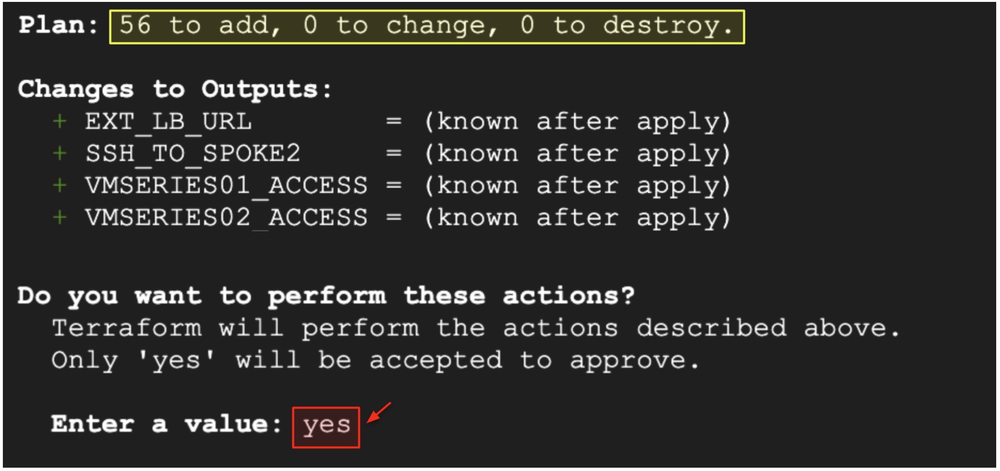
</p>

5. The following output will be displayed when the build completes.

<p align="center">
    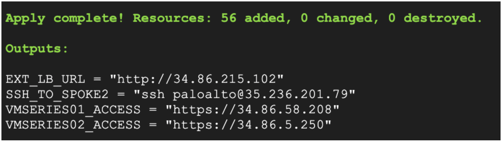
</p>


## Verify Build Completion 

1. The virtual machines can take an additional 10 minutes to finish their bootup process.  
  
2. Copy and paste the `VMSERIES01_ACCESS` and `VMSERIES02_ACCESS` output values into separate web browser tabs.

<p align="center">
    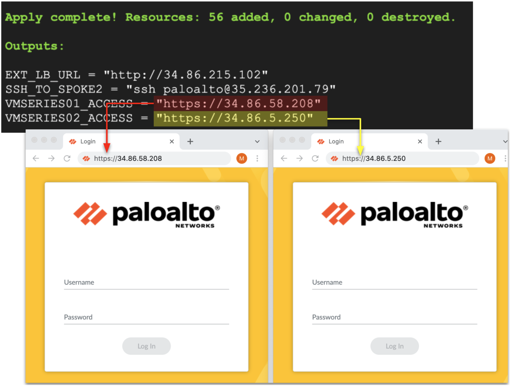
</p>

3. Once you receive the Palo Alto Networks VM-Series login page, use the credentials below to log into the firewalls.

```
Username: paloalto
Password: Pal0Alt0@123
```

## Internet Inbound Traffic 
In this section, we will demonstrate internet inbound inspection to the web application hosted the spoke1 VPC network.  The inbound request will be distributed by the external TCP/UDP load balancer to one of the VM-Series firewall’s untrust interfaces.  Then, the firewalls will inspect and will translate (NAT) the source address to the firewall's trust interface `192.168.2.x/24` and the destination address to the internal load balancer in spoke1 `10.1.0.10`.  

<p align="center"><i>Inbound: Client-to-Server Request</i></p>

<p align="center">
    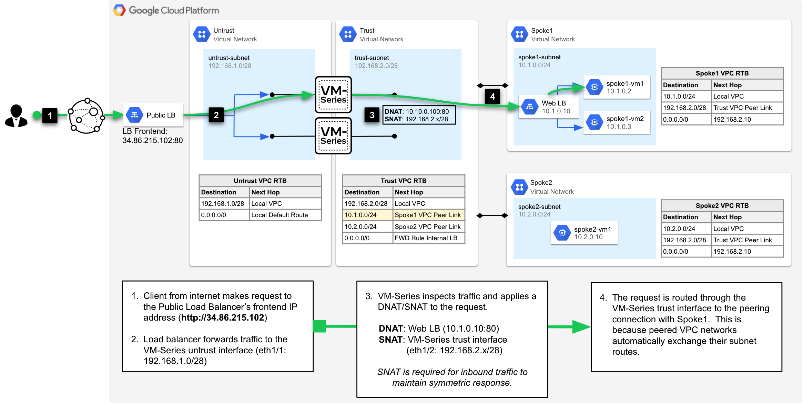
</p>


<p align="center"><i>Inbound: Server-to-Client Response</i></p>

<p align="center">
    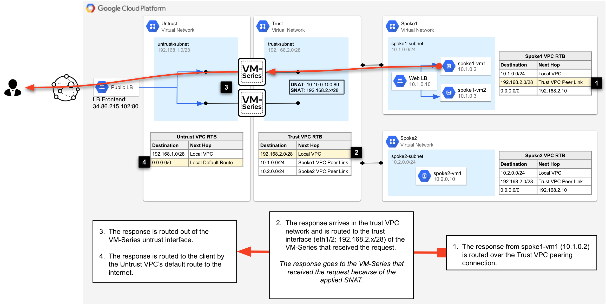
</p>


1. Copy and paste the `EXT_LB_URL` output value into a web browser.  The URL's address is a frontend IP on the external TCP/UDP load balancer.  After the VM-Series inspects and translates the traffic, the URL will resolve to the internal load balancer `10.1.0.10` hosted in spoke1. 

<p align="center">
    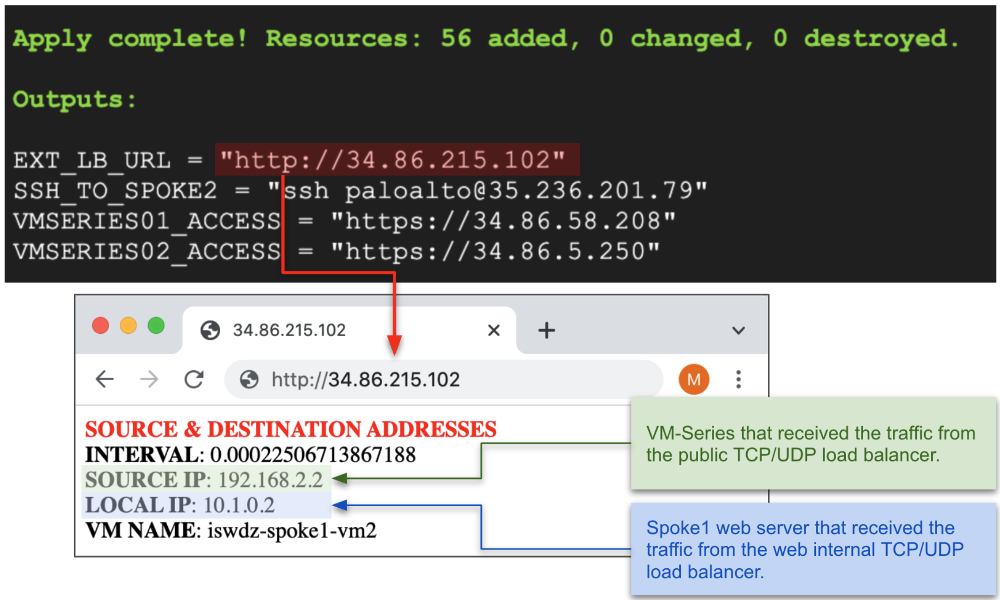
</p>

2. The `SOURCE IP` and `LOCAL IP` values display the VM-Series trust IP address and web VM IP address, respectively. Try refreshing the web page to test the load balancers distribution. The `SOURCE IP` and `LOCAL IP` values will eventually change.  The `SOURCE IP` (firewall IP) is load balanced by the external load balancer and the `LOCAL IP` is load balanced by the spoke1 internal load balancer. 

<p align="center">
    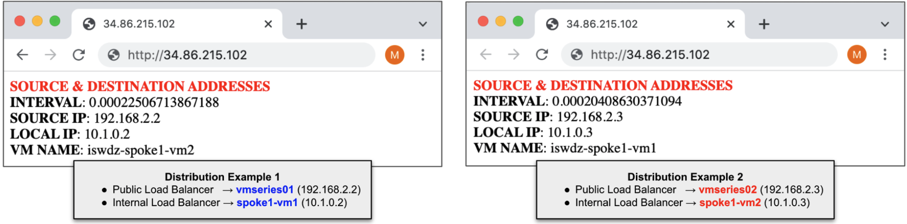
</p>

3. On both VM-Series firewalls, navigate to **Monitor → Traffic**.

<p align="center">
    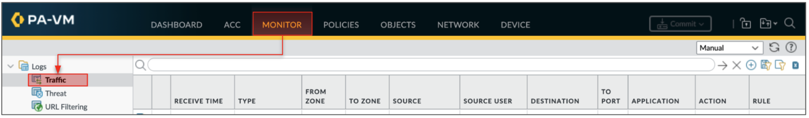
</p>

4. Enter the following into the log search bar.  The filter displays the logs that match your internet inbound traffic to the load balancer in spoke1. 

```
( zone.src eq untrust ) and ( zone.dst eq trust ) and ( app eq web-browsing )
```

<p align="center"><i>Traffic Logs: vmseries01</i></p>

<p align="center">
    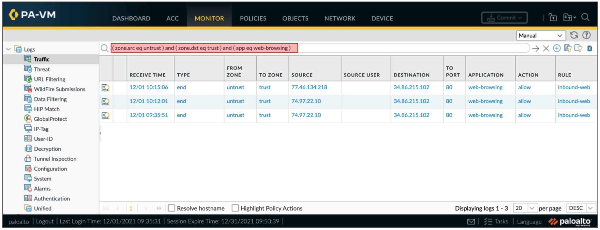
</p>

<p align="center"><i>Traffic Logs: vmseries02</i></p>

<p align="center">
    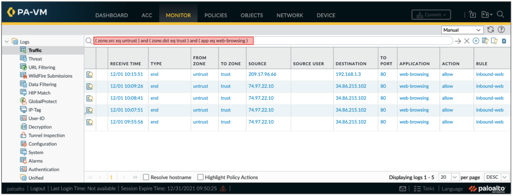
</p>


## Internet Outbound Traffic

In this section, we will demonstrate internet outbound traffic from the spoke networks through the VM-Series firewalls.  The trust VPC network has a default route that uses the VM-Series internal load balancer’s forwarding rule as its next hop.  This default route is propagated to the spoke network’s VPC route tables via the import/export custom route feature by Google Cloud.   Therefore, spoke egress traffic will be routed to its respective peering connection with the trust network.  The trust network’s VPC route table then steers the traffic to the VM-Series internal load balancer for traffic distribution.  Because the traffic is destined for the internet, the VM-Series will inspect and route the traffic out of its untrust interface and to the internet destination. 

<p align="center"><i>Outbound: Client-to-Server Request Path</i></p>

<p align="center">
    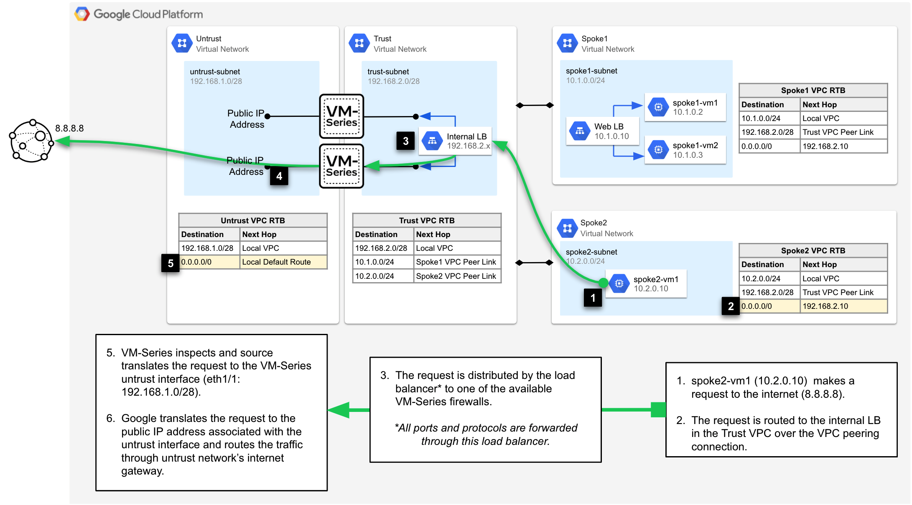
</p>

<p align="center"><i>Outbound: Client-to-Server Response Path</i></p>

<p align="center">
    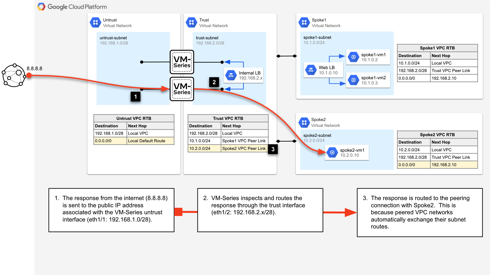
</p>

1. Open an SSH session with the spoke2-vm1 instance.  Copy and paste the `SSH_TO_SPOKE2` output value into cloud shell. 

    Similar to the inbound web traffic example, the SSH address is a public IP associated with the external load balancer.  The load balancer will distribute the session to one of the VM-Series firewalls for inspection.

<p align="center">
    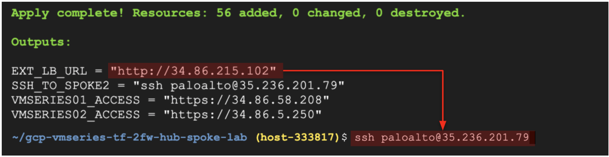
</p>

```
Password: Pal0Alt0@123
```

2. Try generating some outbound internet traffic by running the following commands from the spoke2-vm1 interface.

```
sudo apt update
sudo apt install traceroute
traceroute www.paloaltonetworks.com
```

3. On both VM-Series, go to **Monitor → Traffic** to view the outbound traffic.

4. Enter the following into the log search bar.  The filter displays the logs that match the outbound traffic from spoke2-vm1.

```
( addr.src in 10.2.0.10 ) and ( app eq traceroute ) or ( app eq apt-get )
```

5. In this particular example, we can see that vmseries01 received the apt-get request from the internal TCP/UDP load balancer and vmseries02 received the traceroute request.  This demonstrates the load balancing capability between the VM-Series firewall and the Google Cloud internal load balancers.

<p align="center"><i>Traffic Logs: vmseries01</i></p>

<p align="center">
    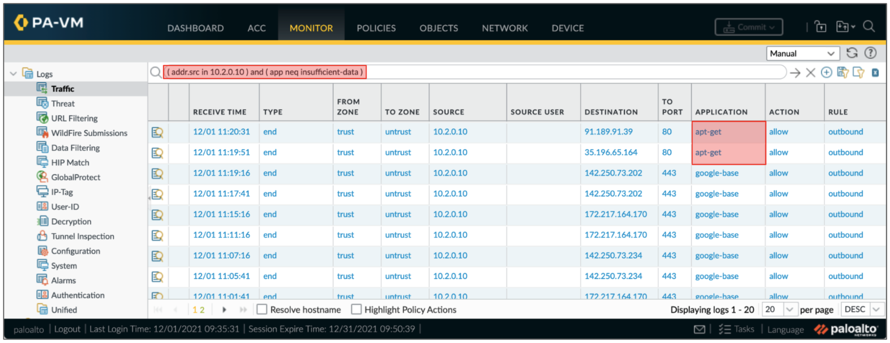
</p>

<p align="center"><i>Traffic Logs vmseries02</i></p>

<p align="center">
    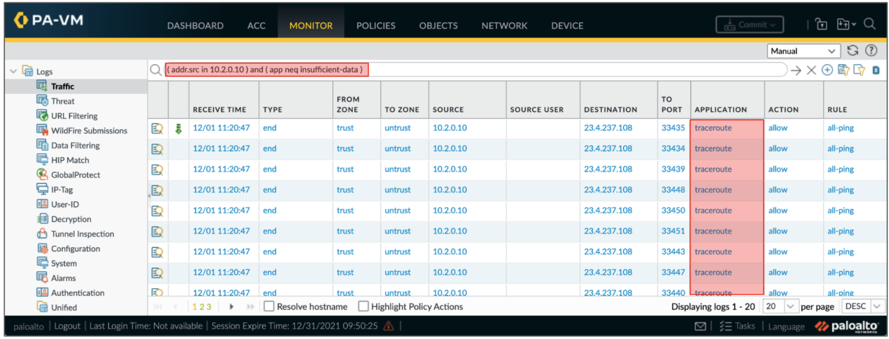
</p>


## East-West Traffic

Now, we will inspect east-west traffic between the spoke networks. The east-west traffic flow is similar to the internet outbound flow as described in the previous section. 

However, instead of routing the spoke's request through the untrust interface, the VM-Series will hairpin the traffic through its trust interface.  Hairpinning east-west traffic provides a simplified design without sacrificing security capabilities.  It is simple because the trust network is peered with the spoke networks, and therefore, has the necessary routes to forward spoke-to-spoke traffic.

<p align="center"><i>East-West: Client-to-Server Request</i></p>

<p align="center">
    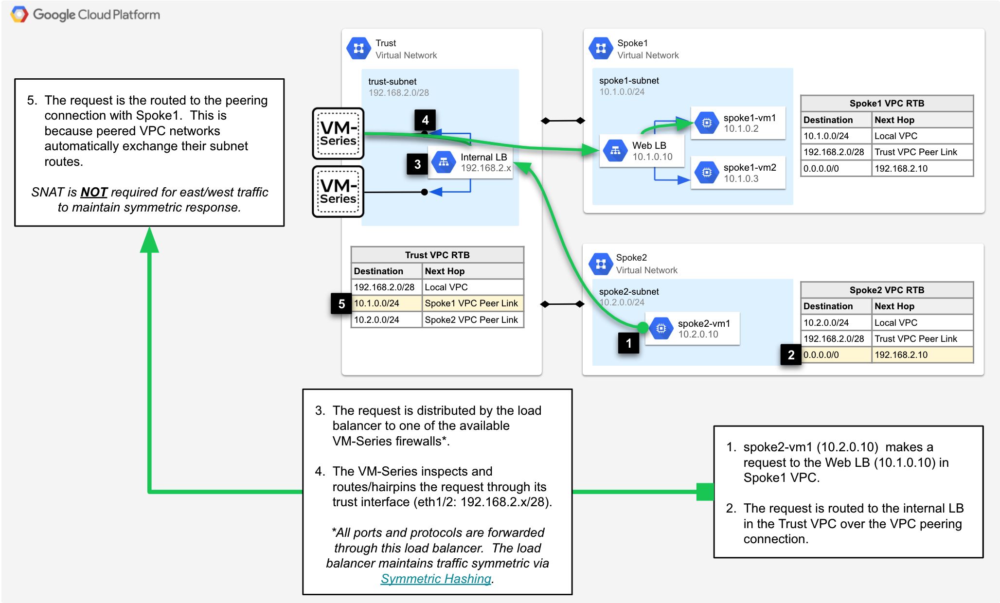
</p>

<p align="center"><i>East-West: Client-to-Server Response</i></p>

<p align="center">
    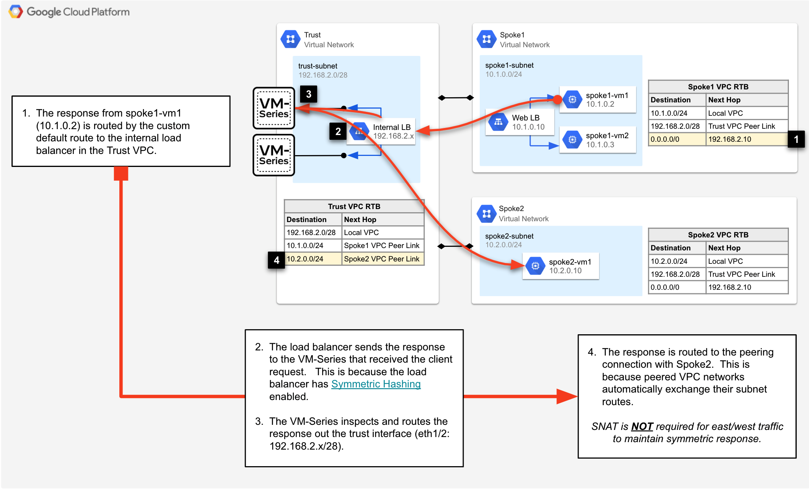
</p>


1. While logged into the spoke2-vm1, launch a repeat curl command to the web server’s internal load balancer in the spoke1 VPC network. 

```
curl http://10.1.0.10/?[1-100]
```

2. On both VM-Series, go to **Monitor → Traffic** to view the east-west traffic.

3. Enter the following into the log search bar.  The filter shows all traffic between spoke2-vm1 and the internal load balancer in spoke1.

```
( addr.src in 10.2.0.10 ) and  ( addr.dst in 10.1.0.10 )
```

<p align="center"><i>Traffic Logs: vmseries01</i></p>

<p align="center">
    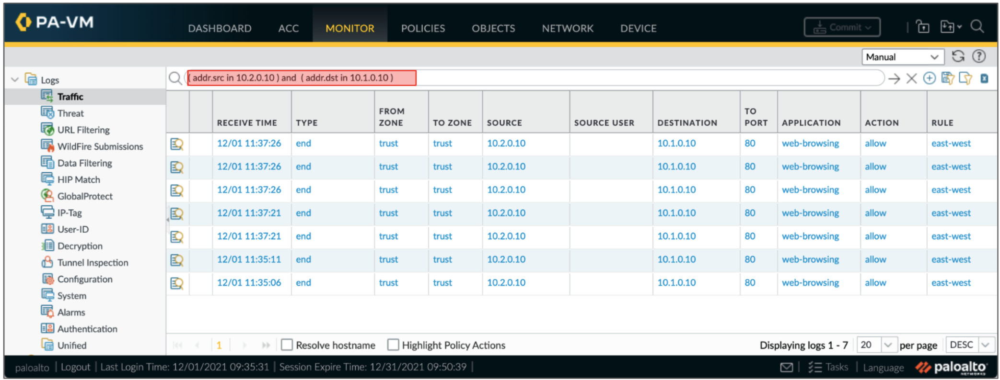
</p>


<p align="center"><i>Traffic Logs: vmseries02</i></p>

<p align="center">
    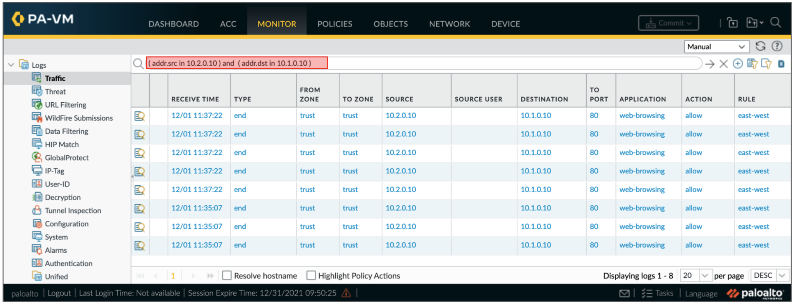
</p>


## Destroy Environment

If you would like to destroy the environment, enter the following in Google cloud shell.

```
cd google-cloud-vmseries-builds/blueprints/vmseries-hub-spoke-vpc-peering
terraform destroy -auto-approve
rm ~/.ssh/gcp-demo
```

## Conclusion

You have completed the architecture blueprint guide.  You have learned how to secure a hub and spoke architecture using the VM-Series and VPC network peering.