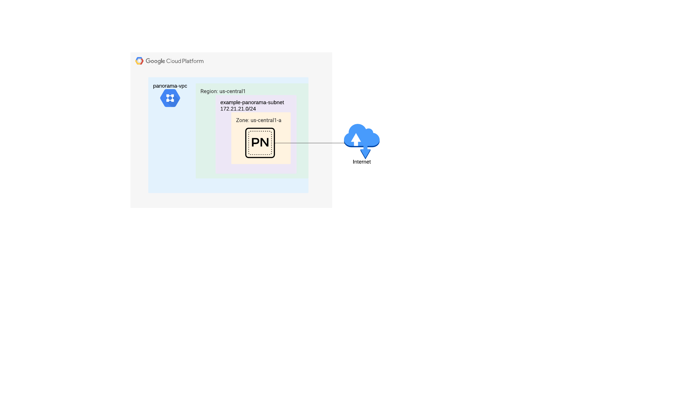

# Palo Alto Panorama deployment example

## Overview

The scope of this code is to deploy one or more Panorama instances in a single project and region in Google Cloud.

Important information :

 - The code builds a single region topology for Panorama
 - VPCs and Subnetworks can be created or read from existing infrastructure
 - Variable construction is documented below

## Topology

The topology for this build as it is pre-completed in the tfvars file is fairly basic consisting of :
 - A VPC and a Subnetwork
 - A panorama instance with a Public IP address attached to the created subnetwork
 - Firewall rules that allow access to the panorama management interface

<p align="center">
    
</p>

## Build

1. Access Google Cloud Shell or any other environment which has access to your GCP project

2. Clone the repository and fill out any modifications to tfvars file (`panorama-example.tfvars` - at least `project`, `ssh_keys` and `allowed_sources` should be filled in for successful deployment and access to the instanceafter deployment)

```
git clone https://github.com/PaloAltoNetworks/terraform-google-vmseries-modules
cd terraform-google-vmseries-modules/examples/panorama
```

3. Apply the terraform code

```
terraform init
terraform apply -var-file=panorama-example.tfvars
```

4. Check the output plan and confirm the apply

5. Check the successful application and outputs of the resulting infrastructure:

```
Apply complete! Resources: 8 added, 0 changed, 0 destroyed.

Outputs:

panorama_private_ip = {
  "panorama-01" = "172.21.21.2"
}
panorama_public_ip = {
  "panorama-01" = "x.x.x.x"
}
```


## Post build

Connect to the panorama instance via SSH using your associated private key and set a password :

```
ssh admin@x.x.x.x -i /PATH/TO/YOUR/KEY/id_rsa
Welcome admin.
admin@Panorama> configure
Entering configuration mode
[edit]                                                                                                                                                                                  
admin@Panorama# set mgt-config users admin password
Enter password   : 
Confirm password : 

[edit]                                                                                                                                                                                  
admin@Panorama# commit
Configuration committed successfully
```

## Check access via web UI

Use a web browser to access https://x.x.x.x and login with admin and your previously configured password

<!-- BEGINNING OF PRE-COMMIT-TERRAFORM DOCS HOOK -->
## Requirements

| Name | Version |
|------|---------|
| <a name="requirement_terraform"></a> [terraform](#requirement\_terraform) | >= 1.0, < 2.0 |

## Providers

| Name | Version |
|------|---------|
| <a name="provider_google"></a> [google](#provider\_google) | n/a |

## Modules

| Name | Source | Version |
|------|--------|---------|
| <a name="module_panorama"></a> [panorama](#module\_panorama) | PaloAltoNetworks/vmseries-modules/google//modules/panorama | 0.5.1 |
| <a name="module_vpc"></a> [vpc](#module\_vpc) | PaloAltoNetworks/vmseries-modules/google//modules/vpc | 0.5.1 |

## Resources

| Name | Type |
|------|------|
| [google_compute_zones.this](https://registry.terraform.io/providers/hashicorp/google/latest/docs/data-sources/compute_zones) | data source |

## Inputs

| Name | Description | Type | Default | Required |
|------|-------------|------|---------|:--------:|
| <a name="input_panoramas"></a> [panoramas](#input\_panoramas) | A map containing each panorama setting:<br><br>Available options :<br>- `panorama_name`          - (Required\|string) Name of the panorama instance<br>- `panorama_vpc`           - (Required\|string) VPC name of the instance where panorama will be deployed. Must be created/imported via "vpcs" variable<br>- `panorama_subnet`        - (Required\|string) Subnet name of the instance where panorama will be deployed. Must be created/imported via "vpcs" variable<br>- `panorama_version`       - (Required\|string) Panorama version available in "paloaltonetworksgcp-public" project<br>- `ssh_keys`               - (Required\|string) SSH keys that will be used for SSH connectivity<br>- `attach_public_ip`       - (Required\|boolean) Flag to to indicate whether to create a public IP address for the management interface or not<br>- `private_static_ip`      - (Required\|string) Static IP address pointed here will be created. It must be a parte of VPC and Subnet cread/imported via "vpcs" variable<br>- `log_disks`              - (Required,list) A list of additional disks to add to the panorama for logging purposes.<br>  - Example of logging disk :<pre>log_disks = [<br>      {<br>        name = "example-panorama-disk-1"<br>        type = "pd-ssd"<br>        size = "2000"<br>      },<br>      {<br>        name = "example-panorama-disk-2"<br>        type = "pd-ssd"<br>        size = "2000"<br>      },<br>    ]</pre>Example of variable deployment :<pre>panoramas = {<br>  "panorama-01" = {<br>    panorama_name     = "panorama-01"<br>    panorama_vpc      = "panorama-vpc"<br>    panorama_subnet   = "example-panorama-subnet"<br>    panorama_version  = "panorama-byol-1000"<br>    ssh_keys          = "admin:<PUBLIC-KEY>"<br>    attach_public_ip  = true<br>    private_static_ip = "172.21.21.2"<br><br>    log_disks = [<br>      {<br>        name = "example-panorama-disk-1"<br>        type = "pd-ssd"<br>        size = "2000"<br>      },<br>      {<br>        name = "example-panorama-disk-2"<br>        type = "pd-ssd"<br>        size = "2000"<br>      },<br>    ]<br>  }<br>}</pre>Multiple keys can be added and will be deployed by the code | `any` | n/a | yes |
| <a name="input_project"></a> [project](#input\_project) | The project name to deploy the infrastructure in to. | `string` | `null` | no |
| <a name="input_region"></a> [region](#input\_region) | The region into which to deploy the infrastructure in to | `string` | `"us-central1"` | no |
| <a name="input_vpcs"></a> [vpcs](#input\_vpcs) | A map containing each network setting:<br><br>Available options :<br>- `vpc_name`          - (Required\|string) VPC name to create or read from<br>- `subnet_name`       - (Required\|string) Subnet name to create or read from<br>- `cidr`              - (Required\|string) CIDR to create or read from<br>- `allowed_sources`   - (Optional\|list) A list of allowed subnets/hosts for which ingress firewall rules will be created with "Allow" statement and "all" ports for that specific VPC<br>- `create_network`    - (Required\|boolean) A flag that indicates if whether to create the VPC or read from an existing one<br>- `create_subnetwork` - (Required\|boolean) A flag that indicates if whether to create the subnetwork or read from and existing one<br>Example of variable deployment :<pre>vpcs = {<br>  "panorama-vpc" = {<br>    vpc_name          = "panorama-vpc"<br>    subnet_name       = "example-panorama-subnet"<br>    cidr              = "172.21.21.0/24"<br>    allowed_sources   = ["1.1.1.1/32" , "2.2.2.2/32"]<br>    create_network    = true<br>    create_subnetwork = true<br>  }<br>}</pre>Multiple keys can be added and will be deployed by the code | `any` | n/a | yes |

## Outputs

| Name | Description |
|------|-------------|
| <a name="output_panorama_private_ip"></a> [panorama\_private\_ip](#output\_panorama\_private\_ip) | Private IP address of the Panorama instance. |
| <a name="output_panorama_public_ip"></a> [panorama\_public\_ip](#output\_panorama\_public\_ip) | Public IP address of the Panorama instance. |
<!-- END OF PRE-COMMIT-TERRAFORM DOCS HOOK -->