# Panorama Staging for VM-Series MIGs

## Overview


This guide describes how to configure a Panorama Device Group and Template Stack to secure the traditional hub-and-spoke network design in Google Cloud.  The Device Group and Template Stack can be used to automatically bootstrap the VM-Series firewalls that are scaled through either a regional or zonal Managed Instance Group (MIG).

Panorama is required for managing autoscaled firewalls because as firewalls are scaled, the VM-Series metadata (defined within the MIG's instance template) bootstrap the VM-Series to a Panorama Device Group and Template Stack.  From there, Panorama automatically pushes the device group and template stack to the VM-Series so it is configured to handle traffic.

<p align="center">
    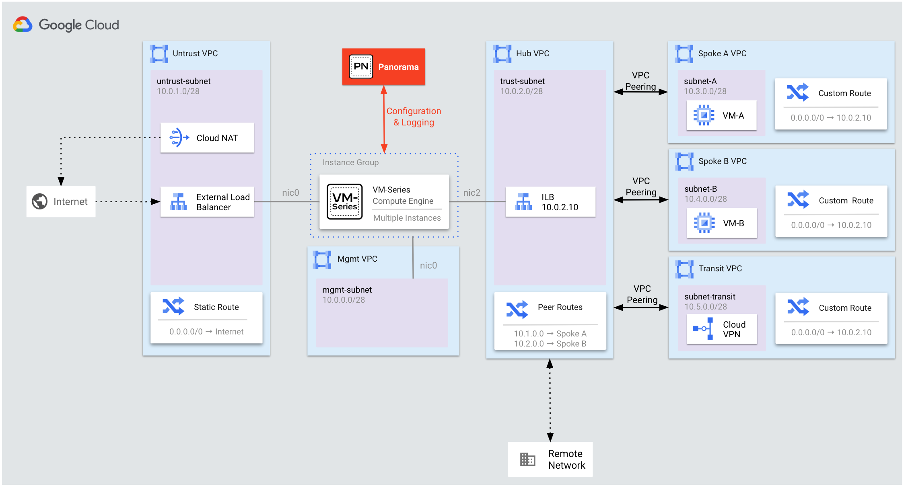
</p>

## Requirements
* A Panorama appliance with PAN-OS 9.1, 10.1, or 10.2.  If you do not have a Panorama appliance, consider using `examples/panorama`.  
## Create a Panorama Template & Template Stack

In this section, we will create a Panorama template and template stack.  

1. Log into your Panorama appliance. Navigate to **Panorama → Templates → Add**.

<p align="center">
    
</p>

2. Enter a name for your template. 

<p align="center">
    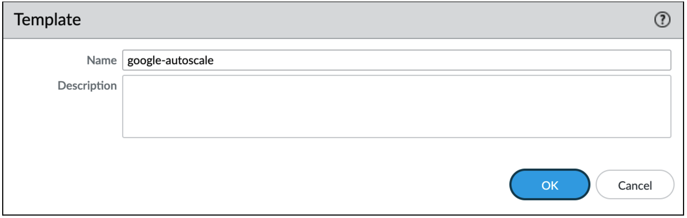
</p>

3. Click **Add Stack** to create a template stack.

<p align="center">
    
</p>

4. Enter a name for the template stack.  In the **TEMPLATES** window, add the template you created in the previous step. 

<p align="center">
    
</p>

> **_Note:_**  Template Stacks are a collection of layered templates.  The VM-Series metadata field, `tplname`,  must reference the name of the **template stack**, not the name of an individual template.


## Configure Template

In this section, we will configure the Panorama template to enable the firewalls to publish VM-Series metrics to [Cloud Monitoring](https://cloud.google.com/monitoring/docs/monitoring-overview).  Then, we will configure interfaces and the Virtual Router to secure spoke networks that are within the RFC1918 address space. 

### Publish PAN-OS Metrics to Google Cloud Monitoring

1. Click the **Device** tab.  From the **Template** drop down, select the template you created in the previous step.

<p align="center">
    
</p>

2. Navigate to **VM-Series → Google**.  Click the gear icon.

<p align="center">
    
</p>

3. Check *ON* **Publish PAN-OS metrics to Stackdriver**.  Set the update interval between `1` and `5` minutes.

<p align="center">
    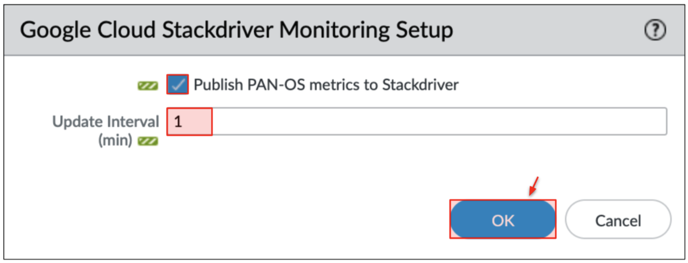
</p>


### Create Security Zones

1. Click the **Network** tab.  Select the template you created in the previous step from the **Template** dropdown menu.

<p align="center">
    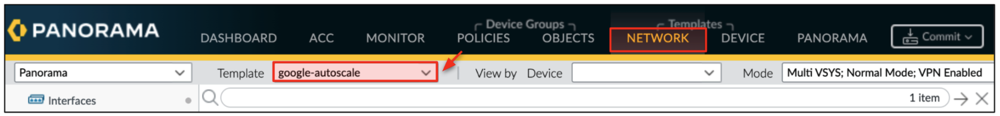
</p>

2. Click **Zones → Add**

<p align="center">
    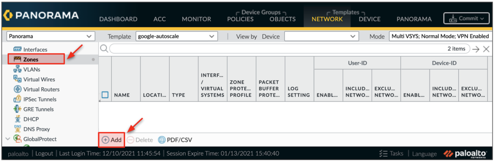
</p>

3. Enter `untrust` for the zone name.  Select `Layer3` for the interface type.

<p align="center">
    
</p>

4. Create a second zone.  Enter `trust` for the zone name.  Select `Layer3` for the interface type.

<p align="center">
    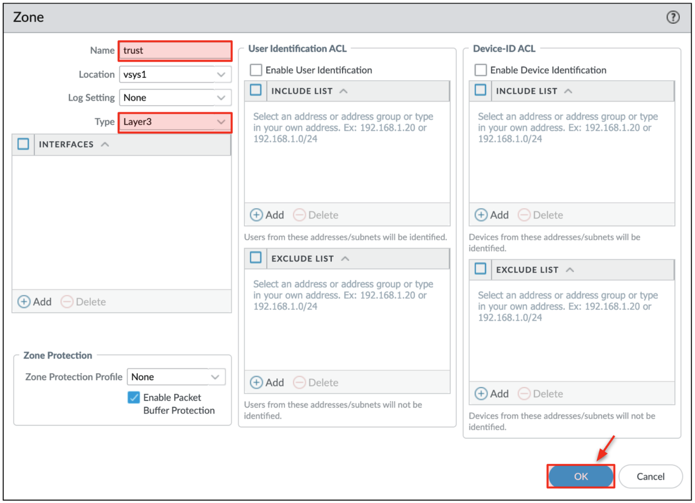
</p>


### Create Virtual Router

1. Click **Virtual Routers** **→ Add**.  Enter `VR1` for the Virtual Router name. 

<p align="center">
    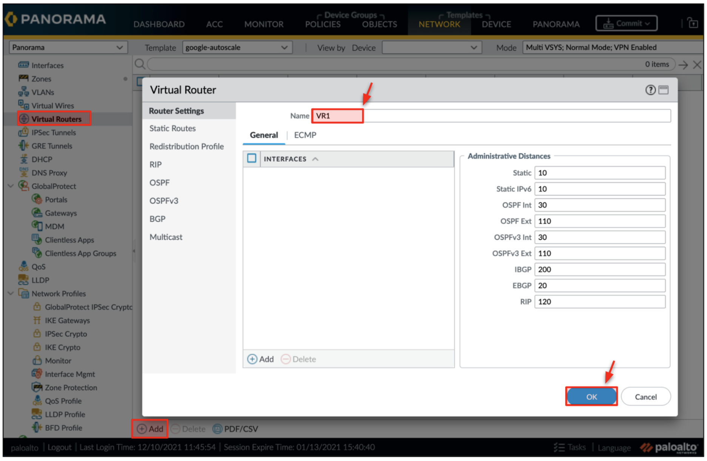
</p>


### Configure Untrust Interface

1. Create the untrust dataplane interface (ethernet1/1).  Click **Interfaces → Add Interface**

<p align="center">
    
</p>

2. Click the **Config** tab.  Set the untrust interface as follows:
    * **Slot** - `Slot 1`
    * **Interface** **Name** - `ethernet1/1`
    * **Interface** **Type** - `Layer3`
    * **Virtual** **Router** - `VR1`
    * **Security** **Zone** - `untrust`

<p align="center">
    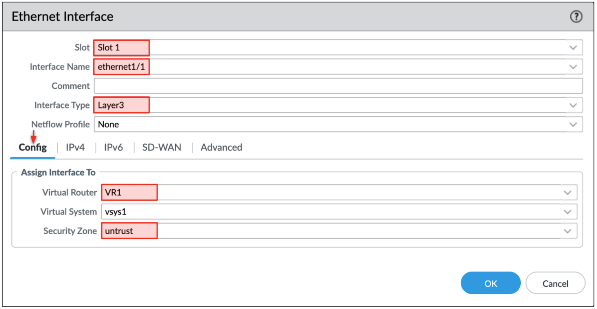
</p>

3. Click the **IPv4** tab.  Select **DHCP Client**.  **_Check ON_** the automatic default route generation box. 

<p align="center">
    
</p>

### Configure Trust Interface
1. Click **Add Interface**.

<p align="center">
    
</p>

2. Click the **Config** tab.  Set the trust interface as follows:
    * **Slot** - `Slot 1`
    * **Interface** **Name** - `ethernet1/2`
    * **Interface** **Type** - `Layer3`
    * **Virtual** **Router** - `VR1`
    * **Security** **Zone** - `trust`

<p align="center">
    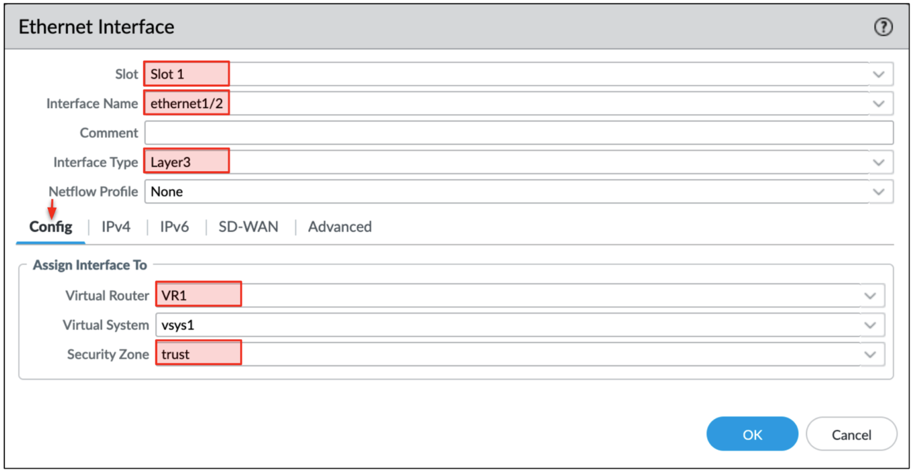
</p>

3. Click the **IPv4** tab.  Select `DHCP Client`.  **_Check OFF_** the automatic default route generation box. 

<p align="center">
    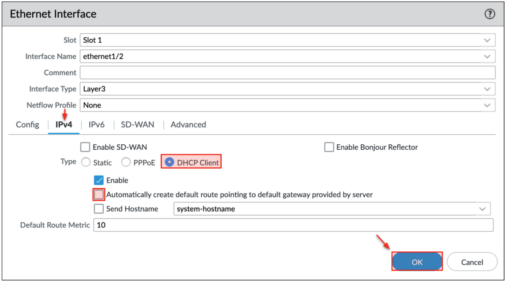
</p>

### Configure Loopback Interface
Google Cloud load balancers distribute traffic to the VM-Series instance group.  Here we will configure a loopback interface that will handle the incoming load balancer health probes. 

1. Click **Loopback → Add**.

<p align="center">
    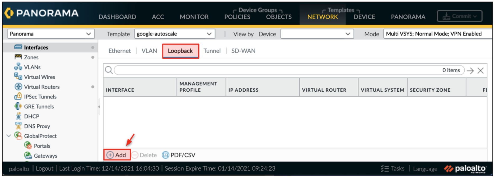
</p>

2. Click the **Config** tab, set the numeric suffix (i.e. `1`). Set the Virtual Router to `VR1` and the Security Zone to `trust`.

<p align="center">
    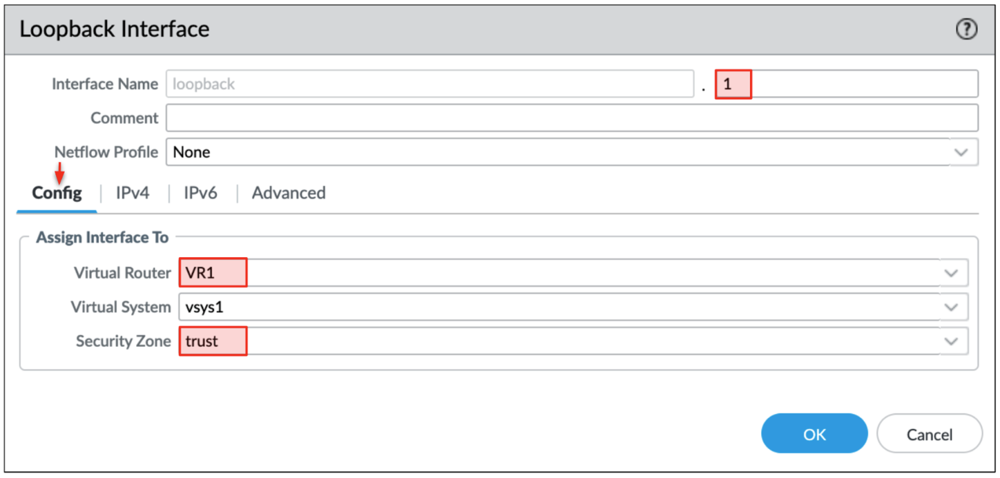
</p>

3. Click the **IPv4** tab, set a "dummy" /32 IP address (i.e. `100.64.0.1/32`).

<p align="center">
    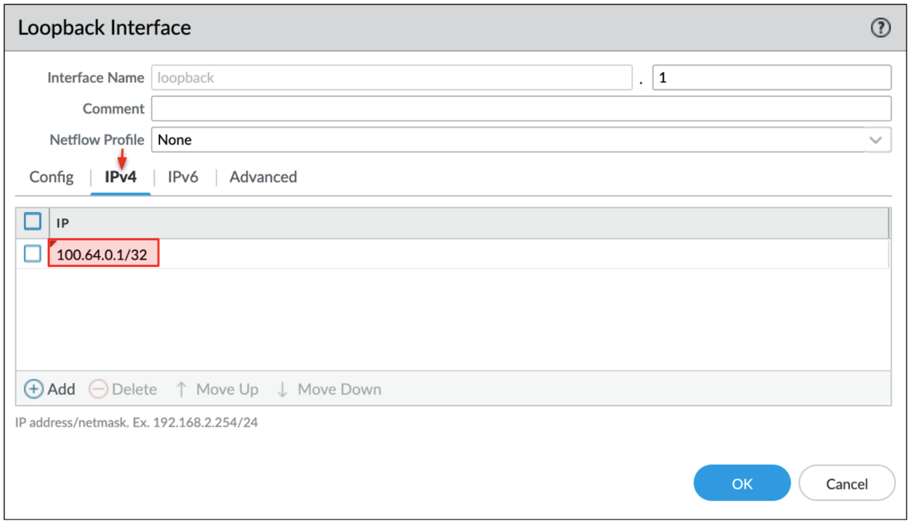
</p>

4.  Click the **Advanced** tab.  Select the **Management Profile** dropdown, click **New Management Profile**. 

<p align="center">
    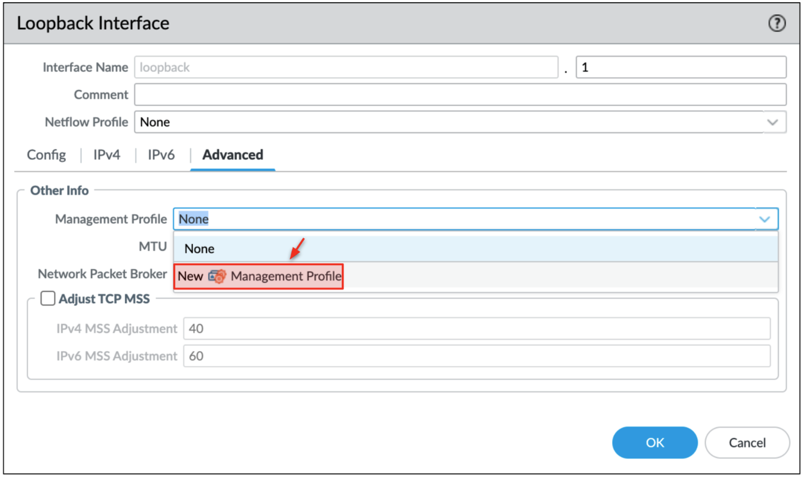
</p>

5.  Enter a name for the Management Profile. Check on the service that corresponds to your health probes port (recommended TCP/80 or TCP/443).  Set the **Permitted IP Addresses** to Google Cloud's dedicated health probe ranges: `35.191.0.0/16` & `130.211.0.0/22`. 

<p align="center">
    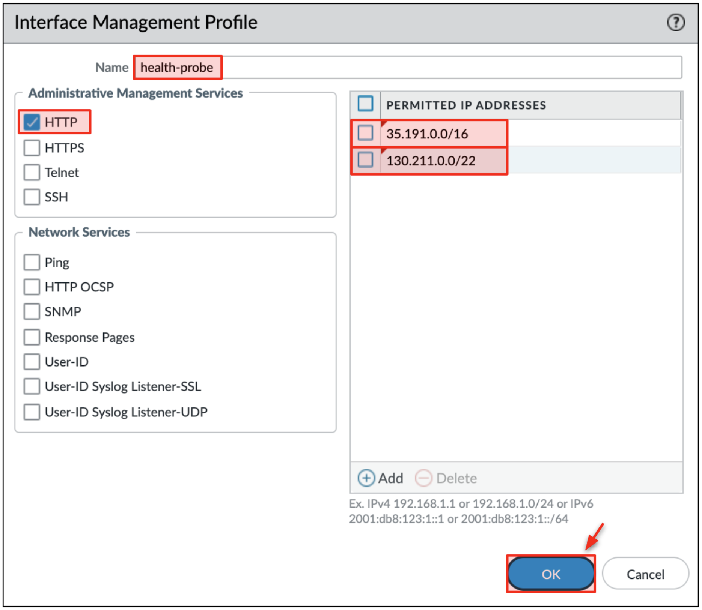
</p>

6.  Click **OK** on the Loopback interface creation window. Click **OK** on the security warning prompt.

<p align="center">
    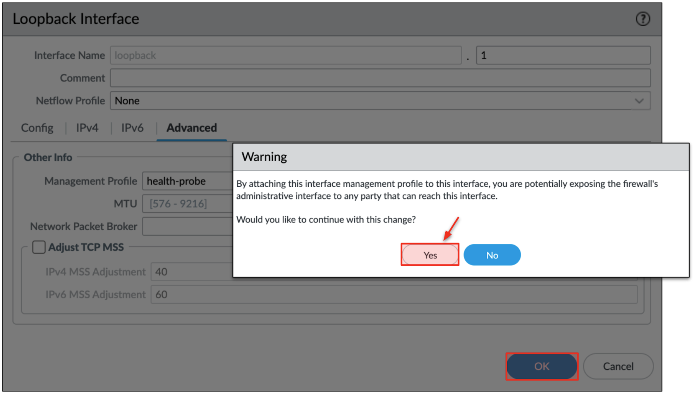
</p>


### Create Static Routes on Virtual Router

Now, we will configure the virtual router to correctly route traffic for spoke networks within the RFC1918 address space.  We will also configure static routes to handle health probes from the internal load balancer. 

> **_Note:_** This guide assumes the trust subnetwork's default gateway is 10.0.2.1.  Please verify you are using the correct default gateway before proceeding.

1.  Go to **Virtual Routers → VR1 → Static Routes → Add**.

<p align="center">
    
</p>

2.  Configure 2 static route as follows.  The routes hairpin the internal load balancer's health probe ranges (`35.191.0.0/16` & `130.211.0.0/22`) through the VM-Series trust interface `ethernet1/2` which has a default gateway of `10.0.2.1`.  

<p align="center">
    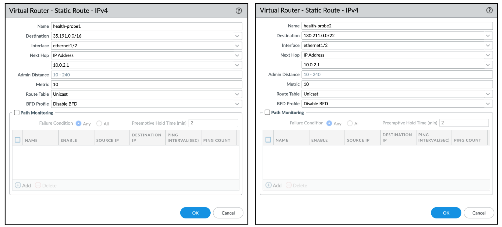
</p>

3.  Configure 3 static routes as follows.  The routes hairpin spoke VPC traffic (within the RFC1918 space) through the VM-Series trust interface `ethernet1/2` which has a default gateway of `10.0.2.1`.   

<p align="center">
    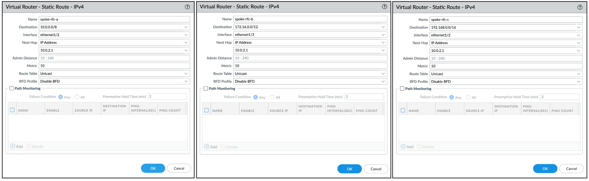
</p>

4.  Your static routes should look like the image below before proceeding.

<p align="center">
    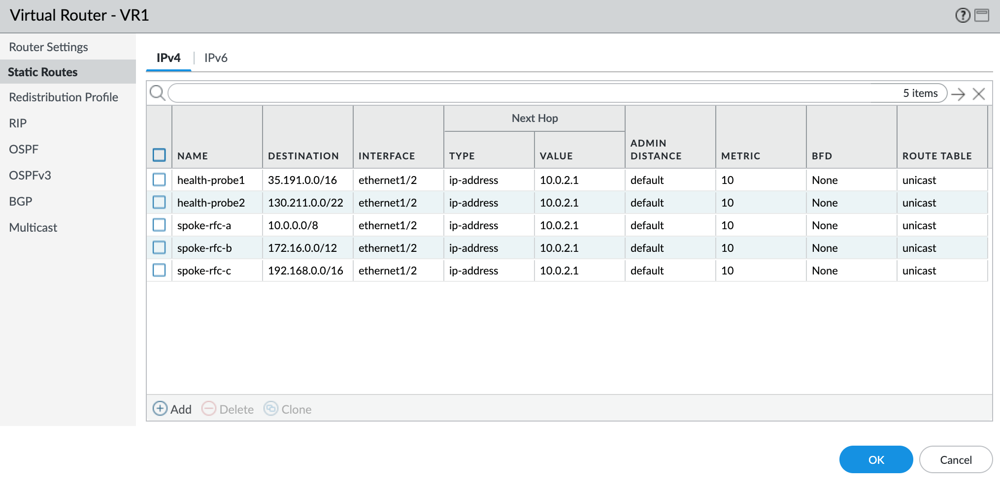
</p>


## Create a Panorama Device Group

In this section, we will create a Panorama device group.

1. Click **Panorama →** **Device Groups → Add**.  

<p align="center">
    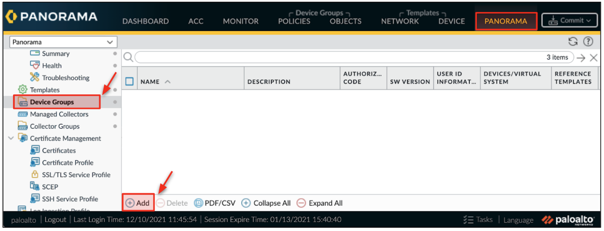
</p>

2. Enter a name for the device group.  In the **REFERENCE TEMPLATES** window, add the _template stack_ you created previously.  Record the name of the device group and template stack.  They will be used in the VM-Series deployment to bootstrap the VM-Series to Panorama.  

<p align="center">
    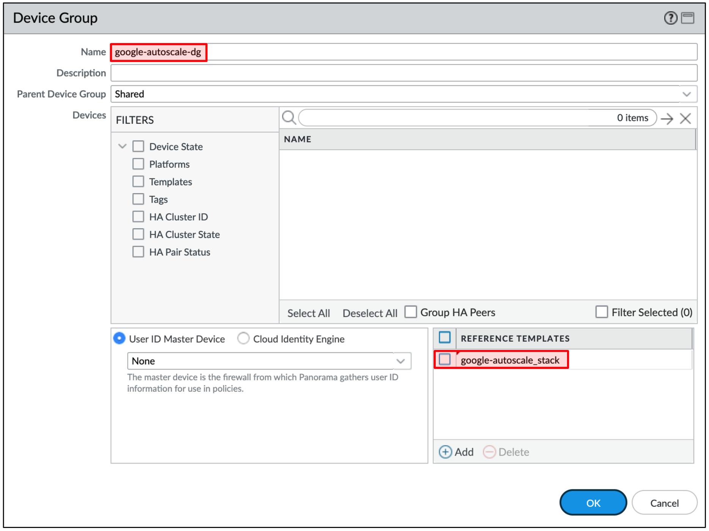
</p>

## Configure Device Group 

In this section, we will configure the device group's security policies to allow the load balancer's health probes and to deny all other traffic.  We will then configure NAT policies to translate outbound internet traffic from the spoke networks and to translate the internal load balancer's health probes. 

### Create Health Probe Security Policy

1. Click the **Policies** tab.  Select the device group you created in the previous step from the **Device Group** dropdown menu.  On the left menu, go to to **Security → Pre Rules → Add**. 

<p align="center">
    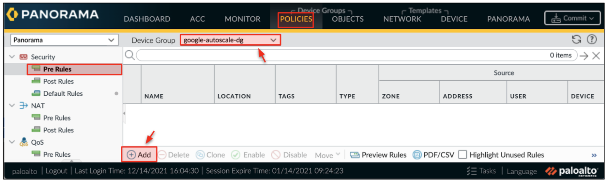
</p>

2. Enter a name for the security policy.

<p align="center">
    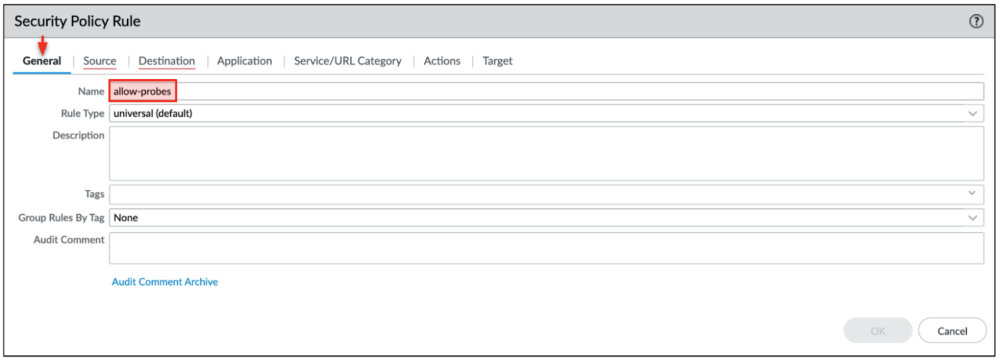
</p>

3. Click the **Source** tab.  Set the **source zone** to `Any`.  Set the **source address** to `35.191.0.0/16` & `130.211.0.0/22`.

<p align="center">
    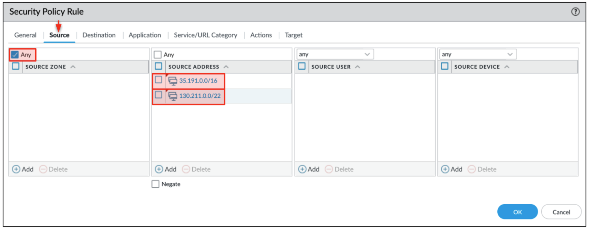
</p>

4. Click the **Destination** tab.  Set the **destination zone** to `Any`.   

<p align="center">
    
</p>

5. Click the **Actions** tab.  Set **action** to `Allow`.  Set the log settings to `Log at Session End` and select your log forwarding profile (optional).

<p align="center">
    
</p>


### Create Destination NAT for Internal Load Balancer Health Probes

1. Go to **Policies → NAT → Pre Rules → Add**. Verify you are modifying the device group you previously created. 

<p align="center">
    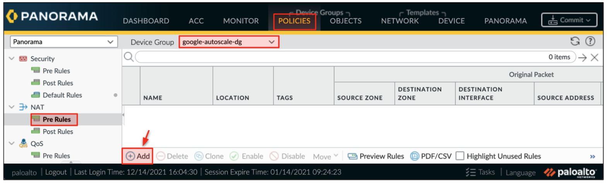
</p>

2. Enter a name for the NAT rule.

<p align="center">
    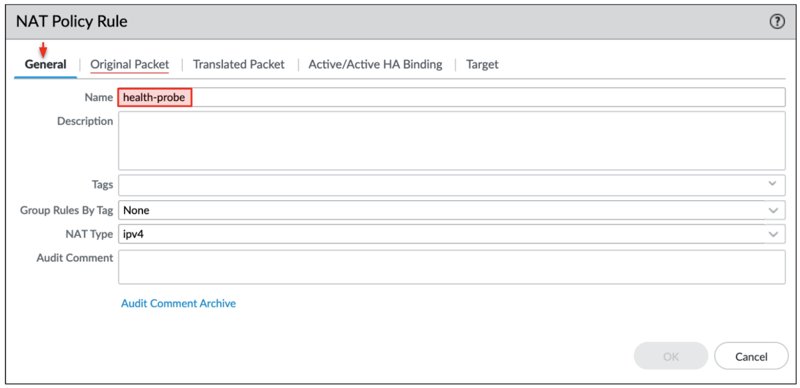
</p>

3. **_Original Packet Tab_**
    * **Source Zone** - `trust`
    * **Destination Zone **-** `trust`**
    * **Destination Interface** - <code>ethernet1/2<strong> </strong></code>(trust interface)
    * <strong>Source Address </strong>- <code>35.191.0.0/16</code> & <code>130.211.0.0/22</code> (health-probe range)

<p align="center">
    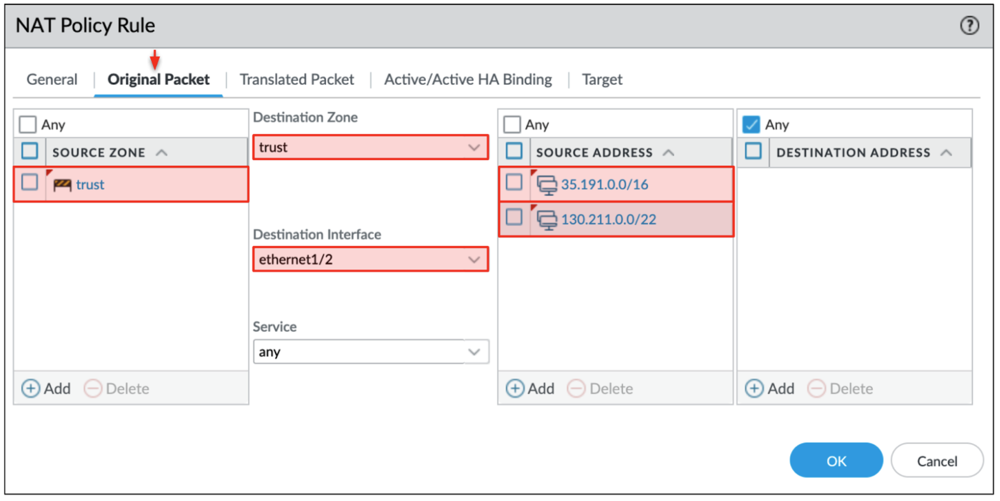
</p>

4. **_Translated Packet Tab_** 
    * Source Address Translation
        * **Translation Type -** `None` 
    * Destination Address Translation
        * **Translation Type -** `Dynamic IP (with session distribution)` 
        * **Translated Address -** `100.64.0.1` (IP address of the loopback interface that we created previously)

<p align="center">
    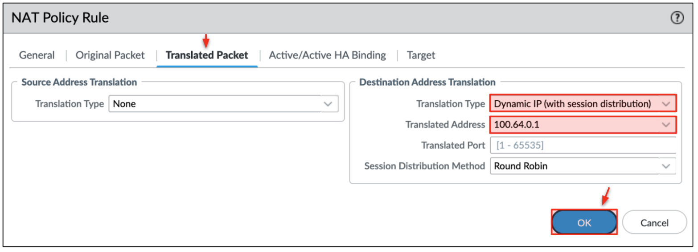
</p>


### Set Predefined Security Rules to Deny and Log

In this section, we will configure the predefined security polices to deny and log all traffic.  It is important to set the intrazone-default rule to deny because all VPC to VPC traffic traverses through the same zone.

1. Go to **Policies → Security → Default Rules**. 
2. _Highlight_ the intrazone-default security policy.  Click **Override**.

<p align="center">
    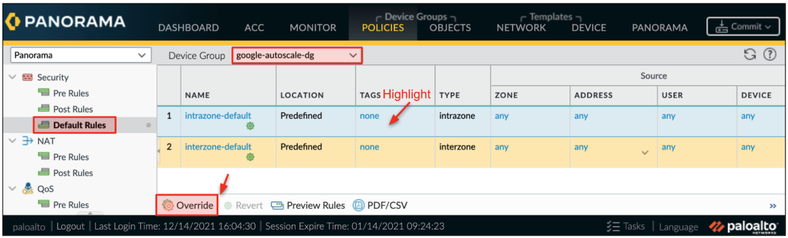
</p>

3. Click the **Actions** tab.  Set the Action to `Deny`.  Check on **Log at Session End** and select your log forwarding profile.  

<p align="center">
    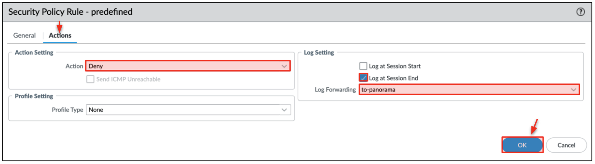
</p>

4. Repeat the process for the **interzone-default** rule.  


## Commit the Changes

1. Commit the changes to Panorama.  **Commit → Commit to Panorama → Commit**.

<p align="center">
    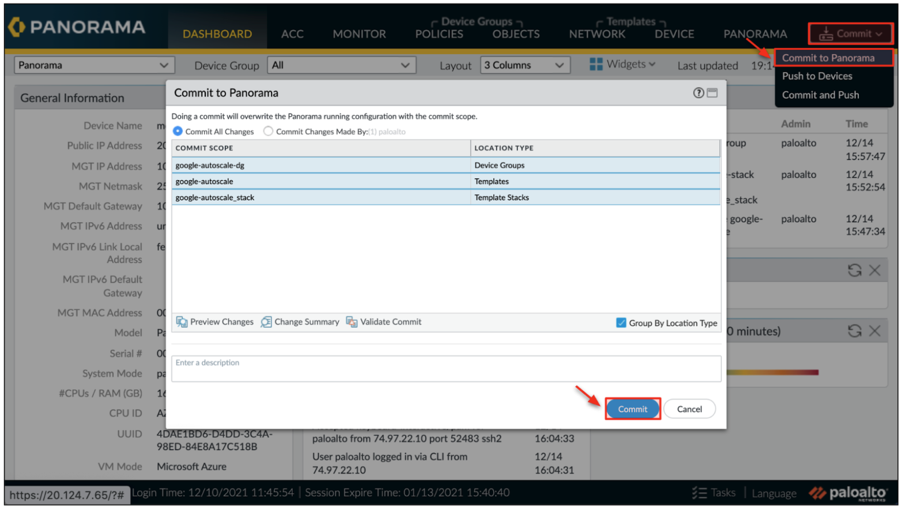
</p>


## Gather information to bootstrap the VM-Series MIG

In this section, we will gather information to bootstrap the VM-Series managed instance group.   This information will be passed as metadata parameters within the MIG's instance template. 

1. Record the name of the **Device Group** (metadata field `dgname`) and **Template Stack** (metadata field `tplname`).   


2. Generate & record a vm-auth-key.  This key is authenticates newly deployed VM-Series to Panorama and enables the firewalls to be added as a managed device.

    1. Log into the Terminal console/CLI of your Panorama appliance. 

    2. Enter the following command to generate a VM Auth Key.   The key lifetime can vary between 1 and 8760 hours.   

```
request bootstrap vm-auth-key generate lifetime <1-8760>
```
3.  Record the vm-auth-key value.  This value is assigned to the vm-auth-key metadata field within the MIG's instance template. 

<p align="center">
    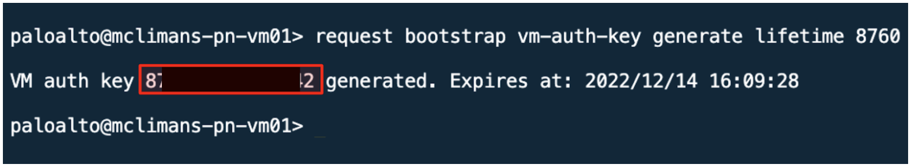
</p>

## Configure Autoscale Module with Bootstrap to Panorama

Below is an example of how to deploy the VM-Series MIG.  The `metadata` variable is configured to bootstrap to the VM-Series firewall we just created.

```
data "google_compute_subnetwork" "mgmt" {
  name   = "mgmt-subnet"
  region = "us-central1"
}

data "google_compute_subnetwork" "untrust" {
  name   = "untrust-subnet"
  region = "us-central1"
}

data "google_compute_subnetwork" "trust" {
  name   = "trust-subnet"
  region = "us-central1"
}

module "autoscale" {
  source = "PaloAltoNetworks/vmseries-modules/google//modules/autoscale"

  name                  = "vmseries"
  region                = "us-central1"
  use_regional_mig      = true
  min_vmseries_replicas = 2
  max_vmseries_replicas = 5
  image                 = "https://www.googleapis.com/compute/v1/projects/paloaltonetworksgcp-public/global/images/vmseries-flex-bundle2-1014"
  create_pubsub_topic   = true
  service_account_email = "vmseries-sa@someproject.iam.gserviceaccount.com"
  autoscaler_metrics = {
    "custom.googleapis.com/VMSeries/panSessionActive" = {
      target = 100
    }
  }

  network_interfaces = [
    {
      subnetwork       = data.google_compute_subnetwork.untrust.self_link
      create_public_ip = true
    },
    {
      subnetwork       = data.google_compute_subnetwork.mgmt.self_link
      create_public_ip = true
    },
    {
      subnetwork       = data.google_compute_subnetwork.trust.self_link
      create_public_ip = false
    }
  ]

  metadata = {
    type                        = "dhcp-client"
    op-command-modes            = "mgmt-interface-swap"
    vm-auth-key                 = "8**************2"
    panorama-server             = "20.4.3.65"
    dgname                      = "google-autoscale-dg"
    tplname                     = "google-autoscale_stack"
    dhcp-send-hostname          = "yes"
    dhcp-send-client-id         = "yes"
    dhcp-accept-server-hostname = "yes"
    dhcp-accept-server-domain   = "yes"
    dns-primary                 = "169.254.169.254"
    dns-secondary               = "8.8.8.8"
  }
}


```


Once the deployment finishes, the bootstrapped VM-Series will appear on Panorama under **Managed Devices → Summary**.

<p align="center">
    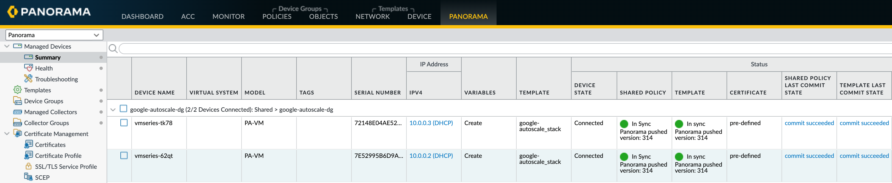
</p>


## Community Supported

The software and templates in the repo are released under an as-is, best effort,
support policy. This software should be seen as community supported and Palo
Alto Networks will contribute our expertise as and when possible. We do not
provide technical support or help in using or troubleshooting the components of
the project through our normal support options such as Palo Alto Networks
support teams, or ASC (Authorized Support Centers) partners and backline support
options. The underlying product used (the VM-Series firewall) by the scripts or
templates are still supported, but the support is only for the product
functionality and not for help in deploying or using the template or script
itself. Unless explicitly tagged, all projects or work posted in our GitHub
repository (at https://github.com/PaloAltoNetworks) or sites other than our
official Downloads page on https://support.paloaltonetworks.com are provided
under the best effort policy.

